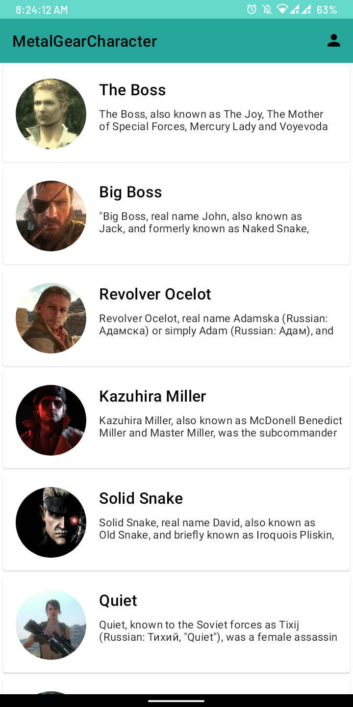
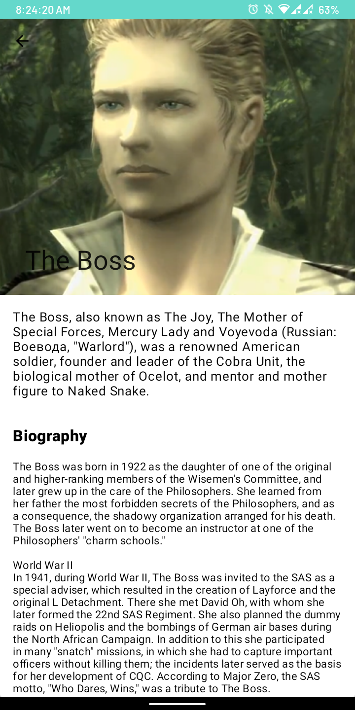
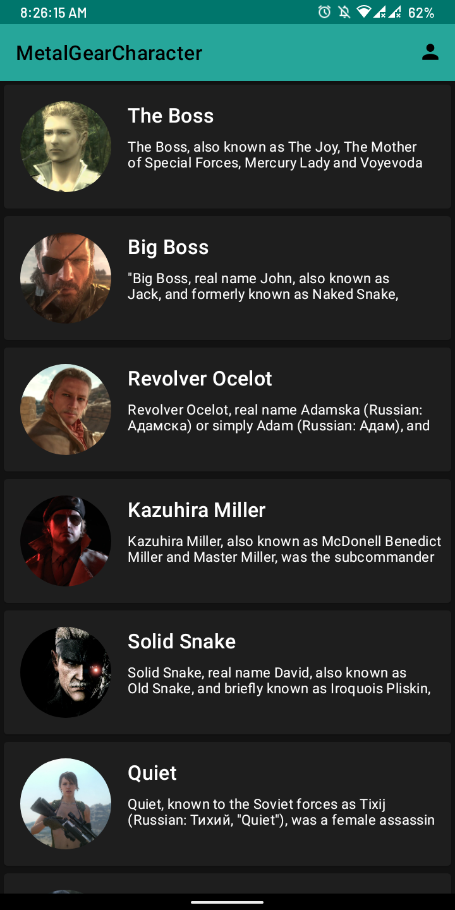
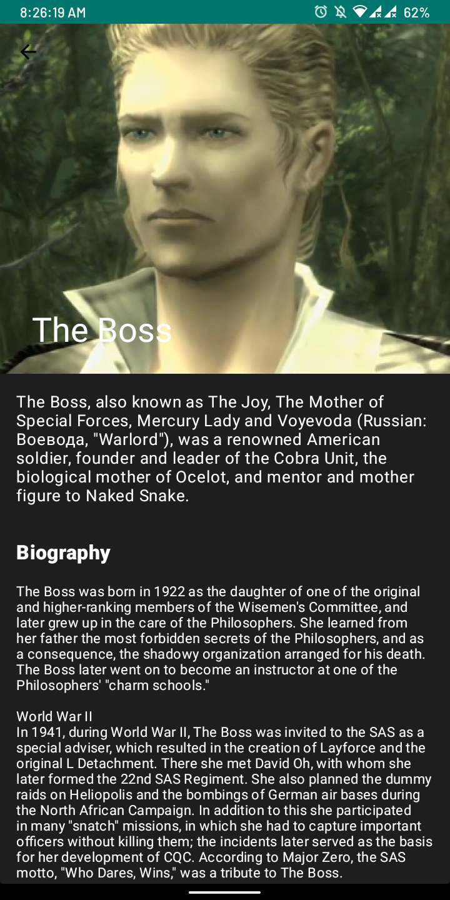
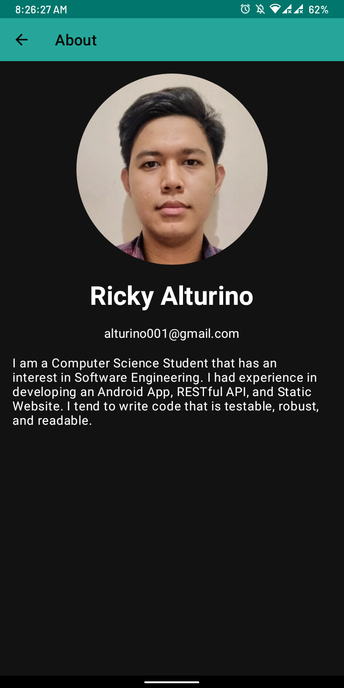

# Metal Gear Character

Metal Gear Character is an demo application based on modern android development. <br>
This project is focusing especially on the implementation of Material Design Component.

[](https://opensource.org/licenses/Apache-2.0)
[](https://android-arsenal.com/api?level=21)
[](https://kotlinlang.org)

## Showcase


### Light Theme
<p align="center">
    
    
    
</p>

### Dark Theme
<p align="center">
    
    
    
</p>


## Download

- Go To [Releases](https://github.com/onirutlA/MetalGearCharacters/releases)
- Download the .apk file
- Install on your phone

## Clone this repository

To clone this repository make sure you git is already installed on your device, then follow this command:
```git
git clone https://github.com/onirutlA/MetalGearCharacters.git
```

Or if you prefer SSH more than HTTPS then follow this command:
```git
git clone git@github.com:onirutlA/MetalGearCharacters.git
```

## Dependencies

- Minimum SDK level 21
- [Kotlin](https://kotlinlang.org) 
- [Coroutines](https://github.com/Kotlin/kotlinx.coroutines) - For asynchronous or simply concurrency
- [Material-Components](https://github.com/material-components/material-components-android) - Material design component ripple, animation, cardview
- [Glide](https://github.com/bumptech/glide) - Image loading library
- [Navigation Component]() - Navigation library for Android

## Support

> **Star** this repository and **Follow** this github to support me 

## Author

[**onirutlA**](https://www.linkedin.com/in/onirutla) - onirutlA@gmail.com

>Metal Gear is trademark of Konami and/or its affiliates
